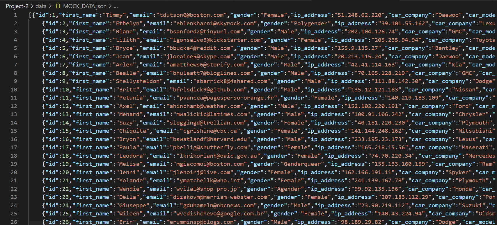
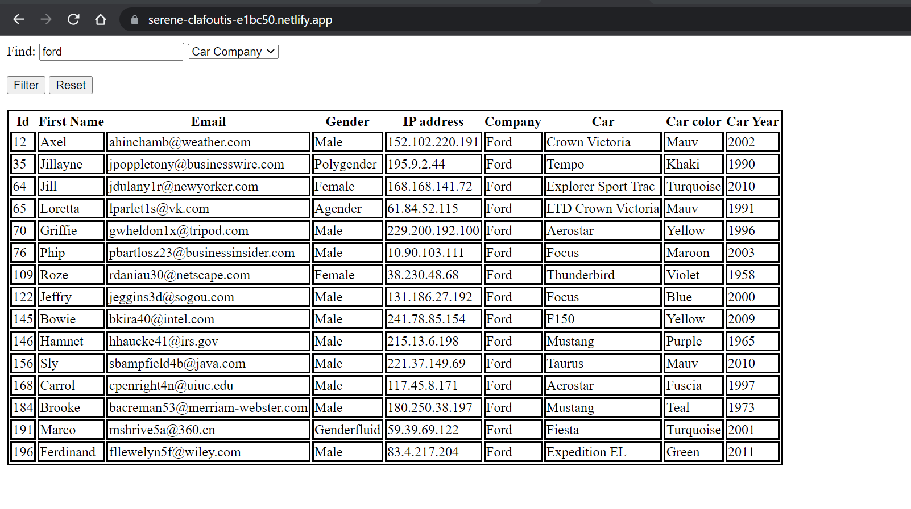

# Project 2 

Topic - Car Database
- First I generated the JSon data using mockaroo.com website.

- the data has 9 attributes and 200 rows.i saved it as MOCK_DATA.json file in data folder.

- then created Html page, index.html and created a table structure and addes a textfield fro user input 
and a dropdown menu and submit and reset buttons.

- then i added a link to cars.js file, in which i have rendertable, getAllCars , getCarbyid functions to filter the data and render it in html file  

- then i deployed the site using netlify 

