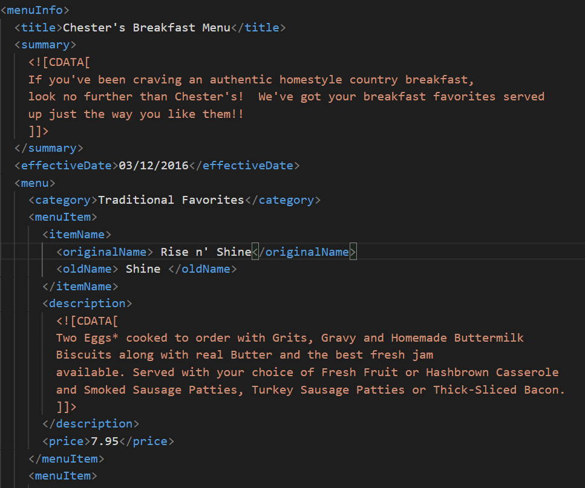
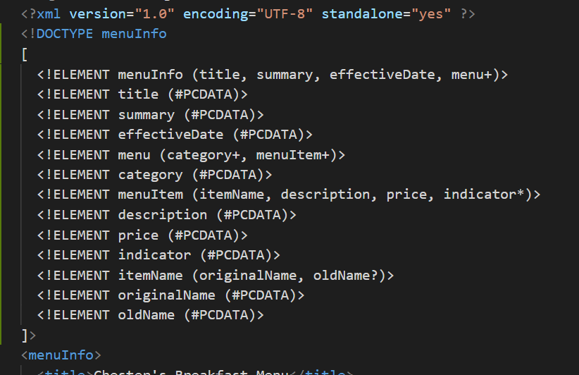

# Assignment Answers
1. there is space between the word 'effective' and 'date'. this is an error as there should not be spaces in tag name.

2.  CDATA block are used when  a text is not to be  interpreted as xml . CDATA is used in this document so that the text between the CDATA tags can be only treated as text,even if it contains xml elements.

3. Comments

4. Prolog

Document body

Epilog

5. Inline DTD

6. Validation

7. CSS

