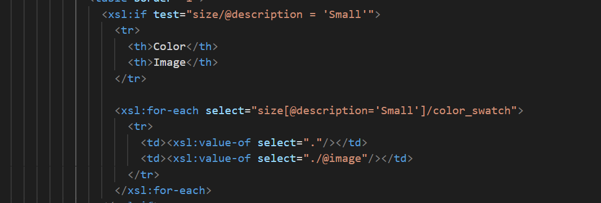

# Assignment 

first , i created a xsl file "assignment.xsl" then i linked it to xml file using href tag.

then i created xsl file and added the required header statements,in html body tag i created the tittle "catalog" in h2 tag, after that i added product id and discription in h3 and paragraph tags respectively. 

after that i used a article tag in li element of a unordered list to create a table in side of it.

in gender column of the table i used a choose statement to display 'm' if the gender is male and 'W' if it's female.

i used a if statement to check if the size is equal to one required to create a sub table.
if a table is created the nested for each statement will select the color and image of color_swatch element given the condition of size is matched.

this is the out-put of the assignment :

